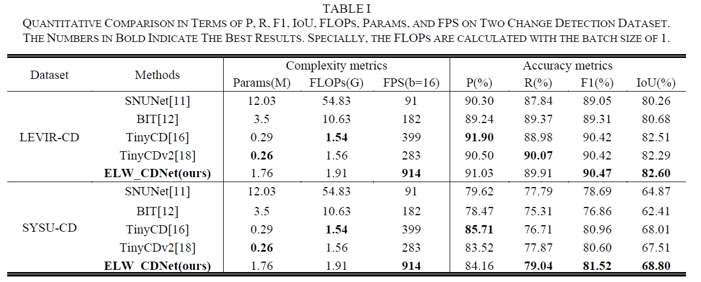

# 
 An Extremely Lightweight Change Detection Algorithm Based on Light Global-Local Feature Enhancement Module (IEEE GRSL 2023) 

This repository contains simple python implementation of our paper [ELW_CDNet](https://ieeexplore.ieee.org/document/10252072).

### 1. Usage
The usage for this repo can reference  [A2Net](https://github.com/guanyuezhen/A2Net)

### 2. Acknowlogdement
This repository is built under the help of the projects [A2Net](https://github.com/guanyuezhen/A2Net), for academic use only.

### 3. Results
We use LEVIR-CD and SYSU dataset for experiments. The results are as follows table.

      

### 4. Citation

Please cite our paper if you find the work useful:

    @ARTICLE{10252072,
      author={Liu, Dongyang and Xie, Baorong and Zhang, Junping and Ding, Rongli},
      journal={IEEE Geoscience and Remote Sensing Letters}, 
      title={An Extremely Lightweight Change Detection Algorithm Based on Light Global-Local Feature Enhancement Module}, 
      year={2023},
      volume={20},
      number={},
      pages={1-5},
      doi={10.1109/LGRS.2023.3315871}}
